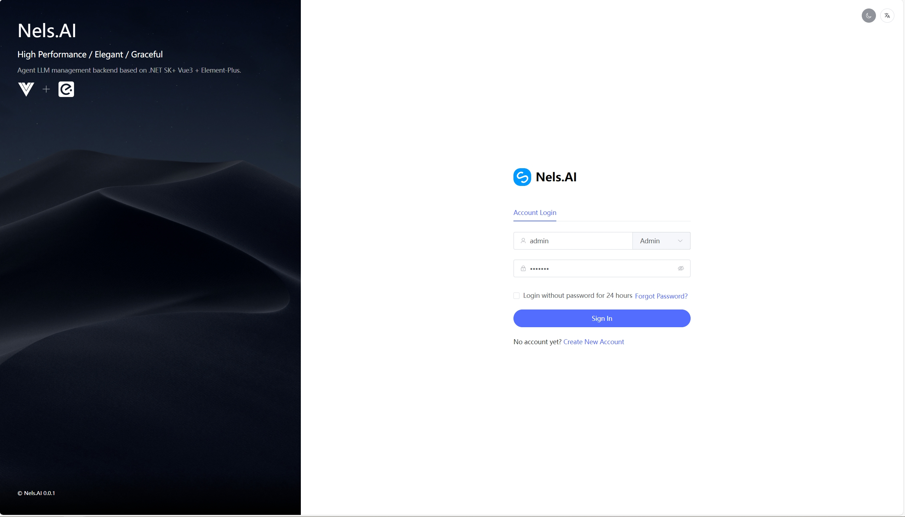
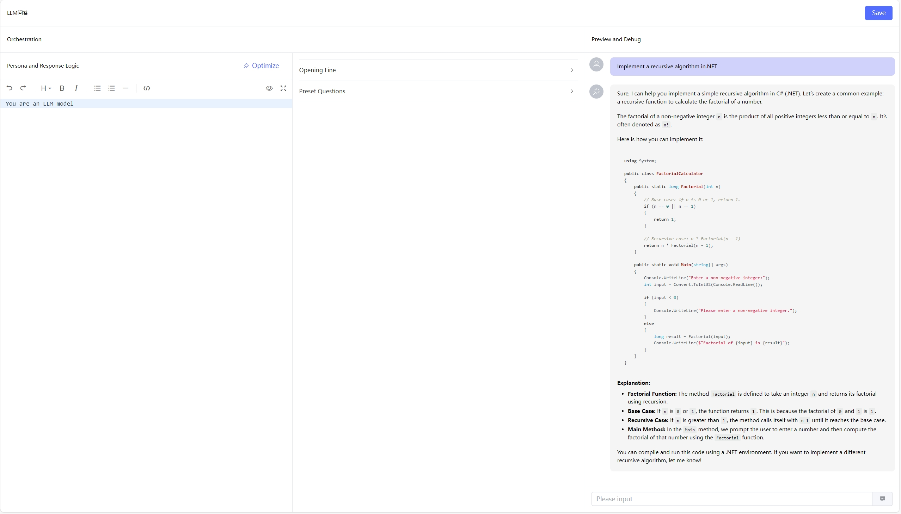

<div align="center"><a name="readme-top"></a>


<h1>Nels.AI</h1>

基于.NET+Vue 构建AI Agent 应用。

[English](./README.en.md) · 简体中文

</div>




## ✨ 技术栈

- 🌈 **后端**：基于ABP后端开发框架
- 🧩 **AI 框架**：semantic-kernel、kernel-memory
- ⚡ **前端**：vue3+js

##  项目目标
使用 .NET 和 Vue 开发，构建一个基于semantic-kernel的AI Agent应用。让开发者能够快对接企业原有的.NET项目，快速构建AI应用。

- 请注意这是一个还在开发中的项目。
- 迫切期待前端精通vue的开发者一起开发。
- 后续计划：知识库管理、工作流。

## 🚀 快速开始

### 下载代码
```bash
git clone https://github.com/nels-ai-source/nels.ai.git
```

### 启动后端服务

#### 1、还原数据库 
打开"程序包管理控制台"将"Nels.DbMigrator"设为启动项，将"Nels.Aigc.EntityFrameworkCore"选为默认项目。

执行命令：更新数据库，需要注意的是提前安装好pgsql 数据库，并在"appsettings"中修改连接字符串
```bash
PM> Update-Database
```

#### 2、执行种子数据
执行"Nels.DbMigrator"控制台程序

#### 3、启动服务
执行"Nels.HttpApi.Host"

### 启动前端

#### 1、安装依赖
```bash
npm install
```

#### 2、启动前端
```bash
npm run serve
```

### 添加模型实例
1. 登录后台，点击顶部菜单中的"设置"中的"模型"页面。
2. 选中一个模型，点击"创建模型实例"，填写key 和描述。

### 创建Agent
1. 登录后台，点击顶部菜单中的"Agent"页面。
2. 新增后，点击Agent卡片即可进入详情页面，设置Prompt开始聊天。

## 如何贡献

如果你希望参与贡献，欢迎提交 [Pull Request](https://github.com/nels-ai-source/nels.ai/pulls)，或给我们 [报告 Bug](https://github.com/nels-ai-source/nels.ai/issues)。

## 引入的开源项目

- [ABP](https://github.com/abpframework/abp)
- [semantic-kernel](https://github.com/microsoft/semantic-kernel)
- [kernel-memory](https://github.com/microsoft/semantic-kernel/tree/main/dotnet/Microsoft.SemanticKernel.Memory)
- [SCUI](https://gitee.com/lolicode/scui)
